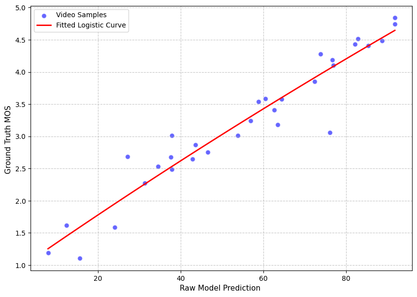

# QuATS: Quality Assessment using Tokenized Sampled Patches

Official implementation of the **QuATS** Video Quality Assessment (VQA) framework, as presented in the QoMEX 2026 Grand Challenge.

QuATS leverages the highly expressive embedding space of the **Qwen3-VL-Embedding 2B** multimodal vision-language model to predict perceptual quality scores. By utilizing a stochastic uniform-sampling-based patching strategy, the model focuses on informative regions while significantly reducing computational complexity.

## Key Features
* **Backbone:** Qwen3-VL-Embedding 2B for rich visual representation.
* **Sampling:** Stochastic, non-overlapping uniform patch sampling with a fixed $64 \times 64$ patch size.
* **Efficiency:** Fine-tuned using **Low-Rank Adaptation (LoRA)**.
* **Inference Modes:** Supports both **Fast** (single pass) and **Robust** (5-pass average) execution modes.

---

## Performance
Evaluation results on the Sport-ROI test set:

| Model Variant | SROCC | PLCC | RMSE | Description |
| :--- | :--- | :--- | :--- | :--- |
| **QuATS-Fast** | 0.9474 $\pm$ 0.0033| 0.9546 $\pm$ 0.0025 |0.3117 $\pm$ 0.0081  | Optimized for inference speed. |
| **QuATS-Robust** | 0.9533 $\pm$ 0.0023 | 0.9588 $\pm$ 0.0019 | 0.3078 $\pm$ 0.0066 | Mean of 5 stochastic passes for higher accuracy. |


<p align="center">   <br> <em>Performance comparison between Fast Mode (left) and Robust Mode (right) showing linear curve fit thorugh the data.</em> </p>
Fig. 1: Correlation between QuATS predicted scores and Ground Truth Mean Opinion Scores (MOS) on the Sport-ROI dataset.
---

## Execution Guide

### Installation
To set up the environment, run the following:

```bash
git clone https://github.com/PragyadiptaAdhya/QuATS.git
cd QuATS
docker build -t vqm-test .
```

### Execution
To execute the Docker build, run the following:
```bash
    docker_run.sh {data_folder} {video_name}.mp4 {dummy_name}.mp4 \
    {output_path}/reports output.txt {output_path}/tmp vqm-test 
```

The following code will write the video file's score to output.txt. It will only contain the floating-point number representing the video's score.

### Toggling between Fast and Robust Mode:
The fast and robust modes are only for inference. The model and training pipeline are the same. To toggle between them in the Docker setup, in the config.py file, set FAST_MODE=False to switch to Robust mode, then rebuild the Docker image. This mode runs the model 5 times per video, stochastically extracting patches per frame and then averaging the scores. Hence, this requires more time to complete.

## Training and Inference Guide the Python Way

### Requirements

To run the model without Docker, certain library requirements must be met. To do the same plese create a new conda environment with python=3.10 and run the following code in it.

```bash
    pip3 install --no-cache-dir -r requirements.txt
```

### Editing the config.py file
The config.py file contains all the recipes for training and inference data paths, as well as the location where the models will be saved in the output directory. In the inference stage, the best_model in the OUTPUT_DIR is used. I'd like you to edit the fields likewise for the same with the paths for your dataset.

### Training
Once you have edited the paths in the config.py, run the following command to train the model.
```bash
    python3 train.py
```
### Inference
The inference script reads the test data path and inference mode from config.py; edit it accordingly. Once done, run the following command. 
```bash
    python3 infer.py
```
Once done, it will create a CSV file in your output directory as given in the repository.

To perform a combined inference across Fast and Robust modes across NUM_EVAL_LOOPS number of times,
```bash
    python3 infer_complete.py
```
Once done, it will create a CSV file in your output directory as given in the repository.

### Analysis
Once you have your CSV files, the analysis is done.ipynb script, replace the obs_csv with the csv file path you got from the infer.py, and the ref_csv is the reference csv file of the data. The code scales the values as per 


$$f(o) = \beta_1 - \frac{\beta_2}{1 + e^{-\frac{(o - \beta_3)}{|\beta_4|}}} + \beta_2$$


where $$o$$ is the model output. After scaling the SROCC, PLCC, KRCC, RMSE, D/S AUC, B/W AUC, B/W CC, and average inference time of the model are shown. A fitted logistic curve between the reference and observed scores is also displayed.
